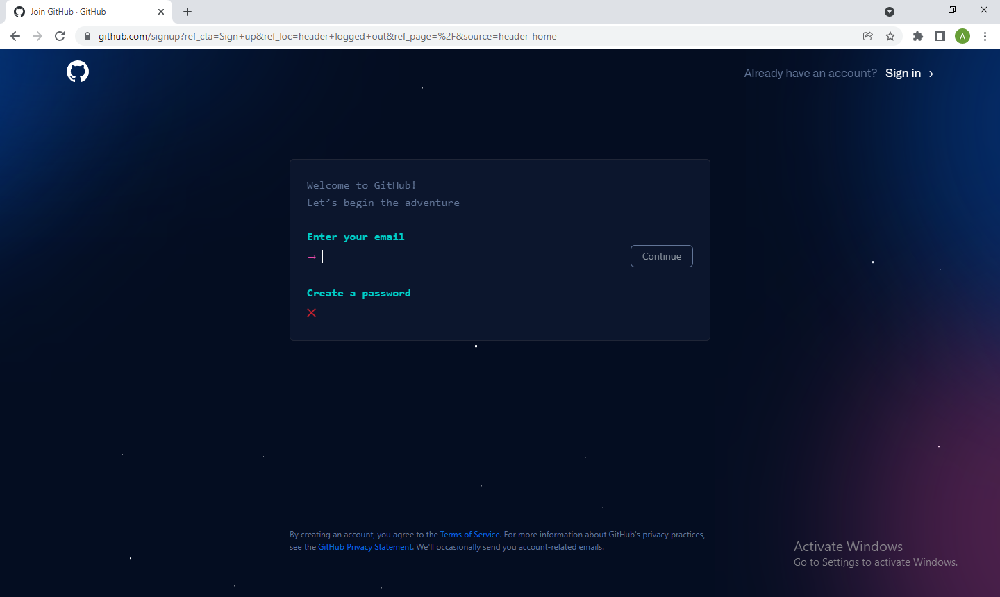
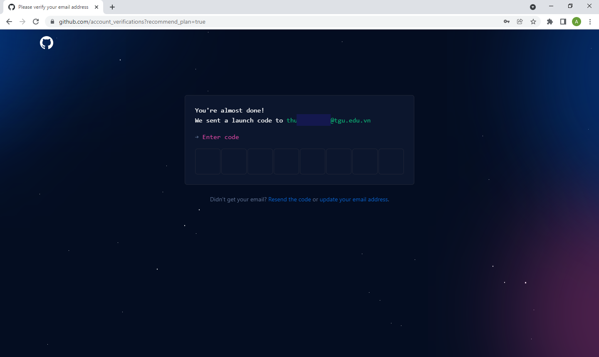

# Github
### Github là gì ?
GitHub là một hệ thống quản lý dự án và phiên bản code, hoạt động giống như một mạng xã hội cho lập trình viên. Nhưng cách sử dụng GitHub như thế nào? Nó sử dụng để hợp tác nhiều người lại với nhau, từ mọi nơi trên thế giới, lên kế hoạch, theo dõi và làm chung một dự án.
 
GitHub cũng là một nền tảng lưu trữ online lớn nhất trên thế giới về các dự án nhiều người làm. 
 
Với khả năng lưu trữ và độ bảo mật cao của mình, GitHub được xem là nguồn lưu dữ liệu mở phổ biến nhất hiện nay. GitHub là sự kết hợp giữa 2 từ:

- Git – hệ thống quản lý dự án và phiên bản code
- Hub – nơi biến những dòng lệnh trên Git thành mạng xã hội cho lập trình viên

GitHub được sử dụng chủ yếu cho dự án có nhiều người cùng hợp tác và cần giám sát toàn bộ thay đổi của dự án. Bên cạnh đó, GitHub còn có khả năng khôi phục code khi cần thiết. Khi sử dụng GitHub, ngoài các công việc chính như tạo Branch, tạo Pull Request và Fork một Repository, bạn có thể theo dõi, tương tác với người khác như một mạng xã hội thông thường.

### Tạo tài khoản Github

- ## Bước 1: Truy cập vào trang web GitHub để tạo tài khoản
Bạn có thể tìm kiếm từ khóa GitHub và chọn đường dẫn vào trang chủ GitHub hoặc bạn có thể chọn đường link bên dưới để truy cập vào trang chủ

> https://github.com

Dưới đây là giao diện trang chủ của Github. Chọn **Sign In** ở góc phải tạo tài khoản :

Nhập thông tin cần thiết để tạo tài khoản.

Để hoàn tất việc tạo tài khoản bạn cần chứng thực địa chỉ Email. Vào email dùng để đăng ký tài khoản. Nhận mã code và nhập vào giao diện bên dưới. 

Sau đó, giao diện giúp cung cấp thêm 1 số trường về tài khoản.Bạn có thể bỏ qua bước này để đi đến đăng nhập bằng **Skip personalization** 

Đến giao diện trang chủ như hình dưới là bạn đã tạo và đăng nhập thành công tài khoản GitHub.

